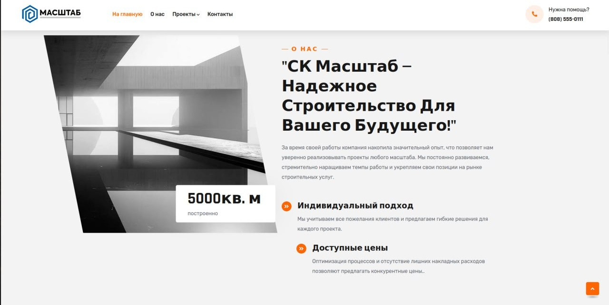

# SK-Mashtab

🌍 Онлайн-версия проекта доступна по адресу: [https://sk-mashtab.ru](https://sk-mashtab.ru)

## 📌 Описание проекта

**SK-Mashtab** — это коммерческий веб-сайт строительной компании, разработанный на Django и развёрнутый в Docker-контейнерах с использованием современных инструментов продакшн-сервинга. Проект построен с учётом масштабируемости, надёжности и удобства сопровождения.

Сайт реализован с нуля и включает backend-логику, работу с медиафайлами, панель администратора, безопасное хранение настроек, и готов к полноценному деплою в продакшн-среду.

---

  
*Основная страница сайта*

---
## ⚙️ Стек технологий

### 🔧 Backend
- **Python 3.12** — язык разработки
- **Django 5.1.8** — основной фреймворк для веб-приложений
- **PostgreSQL** — СУБД (используется через `psycopg2-binary`)
- **Gunicorn** — WSGI сервер для продакшн-среды
- **Gevent** — асинхронный воркер для Gunicorn
- **Pillow** — работа с изображениями (загрузка, обработка)

### Frontend
- **Bootstrap** — адаптивная верстка и стилизация пользовательского интерфейса

### 📦 DevOps / Инфраструктура
- **Docker** — контейнеризация проекта
- **Docker Compose** — оркестрация нескольких сервисов (nginx + Django)
- **nginx** — прокси-сервер, обработка статики и SSL
- **.env + python-dotenv** — централизованное хранение конфигурации

---

## 🚀 Быстрый старт (локально через Docker)

### 1. Клонировать репозиторий
```bash
git clone https://github.com/GvozdevMaxim/skmashtab.git
cd skmashtab
```

### 2. Создать `.env` файл
```env
DEBUG=False
SECRET_KEY=your-secret-key
ALLOWED_HOSTS=127.0.0.1,localhost,sk-mashtab.ru
DB_NAME=DB_NAME
DB_USER=DB_USER
DB_PASSWORD=DB_PASSWORD
DB_HOST=DB_HOST
DB_PORT=DB_PORT
```

### 3. Собрать и запустить
```bash
docker compose up --build
```

После запуска сайт будет доступен на [http://localhost]

---

## 📁 Структура проекта

```
skmashtab/
├── compose.yml            # Docker Compose конфигурация
├── .env                   # переменные окружения
├── nginx/
│   └── skmashtab.conf     # конфигурация nginx
└── skmashtab/
    ├── manage.py          # точка входа Django
    ├── Dockerfile         # инструкция сборки контейнера Django
    ├── requirements.txt   # зависимости проекта
    ├── gunicorn.py        # настройки сервера Gunicorn
    ├── db.json            # дамп базы данных (опционально)
    └── media/             # директория для загруженных файлов
```
---

## 📬 Обратная связь

Если вы хотите обсудить проект или сотрудничество — свяжитесь со мной через GitHub или по почте (gvozdevmaxim.v@gmail.com).

---

## 📝 Лицензия

Проект реализован для коммерческой компании. Код предоставлен исключительно в ознакомительных целях.
